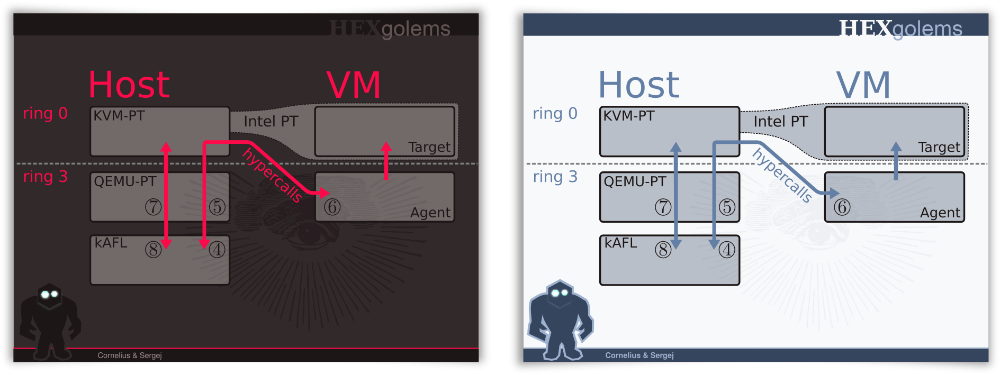

Hexslides: Death to Death by Powerpoint!
=====

Hexslides is an opinionated presentation tool:
* Slides need not be comprehensible on their own, but support your presentation
* Use handouts/notes in combination with slides if you want standalone content.
* Slides should display what you can't tell easily, not repeat what you are telling anyway.
* Slides should be primarily consist of graphic elements.
* Animations are the most important tool to convey complex ideas.
* I hate Powerpoint - There is nothing worse than elements jumping a few pixels from one slide to the next (but I like GUIs to create graphics).
* I hate Latex Beamer (but like text based slide specifications that produce beautiful pdfs).

Hexslides allows you to create presentations with highly expressive animations in your favorite vector graphic drawing tool (such as Inkscape).
Then you combine svg graphics and masters/templates in beautiful presentations.

#### Create highly visual presentations, that support what you are talking about instead of distracting from it!


#### Easily create animations to better present your ideas!

<p float="left" align="center">
   
   
  
</p>

#### Use textex for your math typesetting needs, and combine them with easy, manual layouting for complex situations and animations!
<p align="center">

</p>

#### Automatically generate handouts that work well with Animations!


#### Use custom color replacement rules to convert your graphics from one template/style to another!



How Does it Work?
----------
In short: create `svg` files in `imgs/`. Specify which layers are part of which slide by modifying `slides.tex`. Run `make` and enjoy your freshly crafted `slides.pdf`. To get started, you can copy `imgs/example.svg` and modify it!

A bit longer: for each animation (or slide), you create a simple `.svg` file, that contains all moving objects as layers. The script `gen.rb` (which is called by the makefile) converts each
individual layer into one individual `.pdf` file stored in `imgs/generated/$filename_$layername.pdf`. Then we use Latex
to compile all images into a full presentations. 

For example, the following code is used to show `layer1` in all frames, `layer2` only in frame 2 to 4 while `layer3` is shown in frames 3 and 5. You can 
specify visibility using the typicall (for Latex-Beamer) notations such as `3-4,5,7`.

```
\slide{
  \asvg{1-}{example_layer1}
  \asvg{2-4}{example_layer2}
  \asvg{3,5}{example_layer3}
}
```

The `\slide` command is a thin wrapper around the `\slidecustom` command, that can also specify a background and
foreground image. By default `\slide` uses the background from `imgs/template.svg` but you can simply create different
layouts/masters.


```

\slidecustom{template_clear_bg}{template_foreground}{
  \asvg{1}{example_layer1}
}
```

Handouts
-------
Hexslides has first class support for generating handouts. By simply running `make handout` a handout version of the slides is generated. You 
can use the `anote{}` command to embedd a minipage that will only appear in the handouts. In contrast to beamer handouts will include each frame by default as our slides typically make heavy  use of animations. However, note how `\slide` and `\slidecustom` both take an additional optional argument that specifies which frames to include in the handouts. This is very usefull if you do not want to include all frames, but still want to include some animations.

```
%create a slide with default background and foreground
% only print frame 1 and 4 in the handouts
\slide[1,4]{ 
  \anote{
    \begin{itemize}
      \visible<1->{\item This slide displays a set of animated frames}
      \visible<4>{\item layer 2 is visible in frames 2 to 4. Note that frame 4 is actually the same as frame 3}
      \visible<4>{\item layer 3 is visible in frames 3 and 4}
    \end{itemize}
  }%
  \asvg{1-}{example_layer1}  %visible in all frames
  \asvg{2-4}{example_layer2} %visible in frames 2 to 4
  \asvg{3,4}{example_layer3} %visible in frames 3 and 4
}
```

Tricks
------

* You can edit `theme/gen.rb` to replace colors in the svg files. This allows to easily transfer content across themes.
* Edit `theme/commands.tex` if you need multiple different slide masters to avoid using the longer `\slidecustom`
  command too much.
* The default color scheme for dark backgrounds contains two seemingly identical colors `main` and `highlight_red`. They
  differ only in the least significant bit of one channel. This allows the color replacement to assign two different
  colors. For a bright Theme, `main` can be turned into black, while `highlight_red` could remain a darker shade of red.
  Use this to your advantage to assign semantical colors.
* Typically you will store all elements of a single animation in one svg and use one `\slide` command to
  generate a slide from this. However, you can easily split larger animation across multiple svg files or `\slide`
  commands. This is helpfull to maintain easy editing (changing frame numbers can be hard for animations with many steps).
* Layers starting with `__` are not exported. You can use this to create a backdrop that contains the theme. That way you know exactly what your slide will look like in the final version.
* You can edit pdfs in inkscape. This is very usefull to reuse figures or plots from other sources.
* A list of inkscape tutorials that you might find helpfull: 
    * [getting started](https://www.youtube.com/watch?v=XP-Cyn0leP8)
    * [getting started 2](https://www.youtube.com/watch?v=i12Oth28iZM)
    * [getting started 3](https://www.youtube.com/watch?v=Jsqfag9DSU8)
    * [text ribbons](https://www.youtube.com/watch?v=wQHC38-6phs)
    * [flow charts](https://www.youtube.com/watch?v=G5LI695MiLY)
    * [edit pdf figures](https://www.youtube.com/watch?v=hLyox9Kj8o8)


Install
------

```
apt-get install inkscape gimp texlive-full texlive-lang-german texlive-doc-de texlive-latex-extra latex-mk
cp theme/hexgolems_theme.gpl ~/.config/inkscape/palettes/
mkdir /tmp/textext
cd /tmp/textext
wget 'https://bitbucket.org/pv/textext/get/9260a2461344.zip'
unzip 9260a2461344.zip
cp -r pv-textext-9260a2461344 ~/.config/inkscape/extensions 
```

Import the `theme/hexgolems_theme.gpl` as custom color palete in Inkscape.

Use the textex plugin to render Latex in your svgs, and the provided macros to display the generated pdfs.
